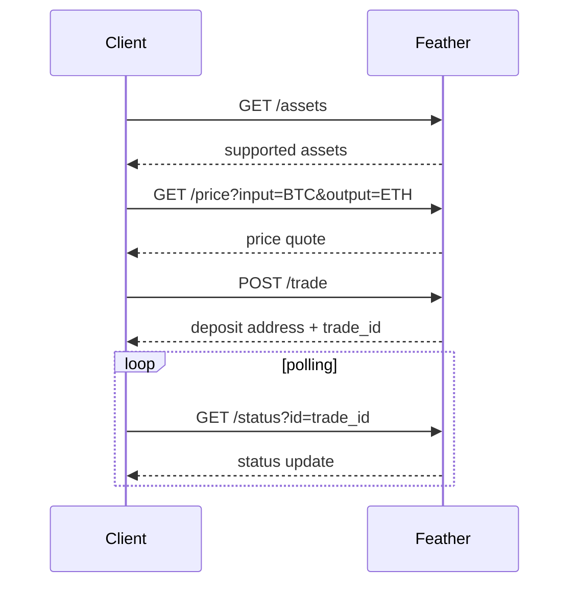

# Quick Start

You can quickly try out feather on the Tristero frontend by making a trade between a route that supports it. Visit the [Tristero app](https://app.tristero.com) to make your first trade: Simply select two assets supported by Feather, and you will be guided through a process to make a deposit to an address on the source side.

The Tristero system does not currently support automatic daisy-chaining from Tristero's smart contract routes to Feather's routes. However you can just manually make two trades in sequence via USDC or ETH to trade arbitrary EVM assets into or out of Feather's assets.

## Using Feather Programmatically

Feather is designed to be easy to integrate. Anything that can make HTTP requests and initiate funds transfer can trade via Feather. There are only four API calls you may need to make when setting up and executing a trade. API calls should be made to `https://feather-prod.tristero.com`:

<div style={{maxWidth: '400px', }}>

</div>

You can read about integration in more detail in our [API Reference](/docs/feather/getAssets).

### Python SDK

The Tristero Python SDK also has support for placing Feather trades.
```sh tab="pip"
pip install tristero
```
```sh tab="poetry"
poetry add tristero
```
```sh tab="uv"
uv add tristero
```

A simple ETH->BTC swap can be initiate with the code below:

```py
src_t = TokenSpec(chain_id=ChainID.ethereum, token_address="native")
dst_t = TokenSpec(chain_id=ChainID.bitcoin, token_address="native")
dst_addr = "YOUR_XMR_ADDRESS"

swap = await start_feather_swap(
    src_t=src_t,
    dst_t=dst_t,
    dst_addr=dst_addr,
    raw_amount=1e17,
)

order_id = swap.data['id']
if not order_id:
    raise RuntimeError(f"Feather swap response missing order id: {swap.data}")

print("deposit_address:", swap.deposit_address)
print("Waiting for completion...")
async for update in wait_for_completion(order_id, order_type=OrderType.FEATHER):
    print(update) # Iterate over order update events
```

For more information, you can refer to the [Python SDK](/docs/tristero/python-sdk) docs.
